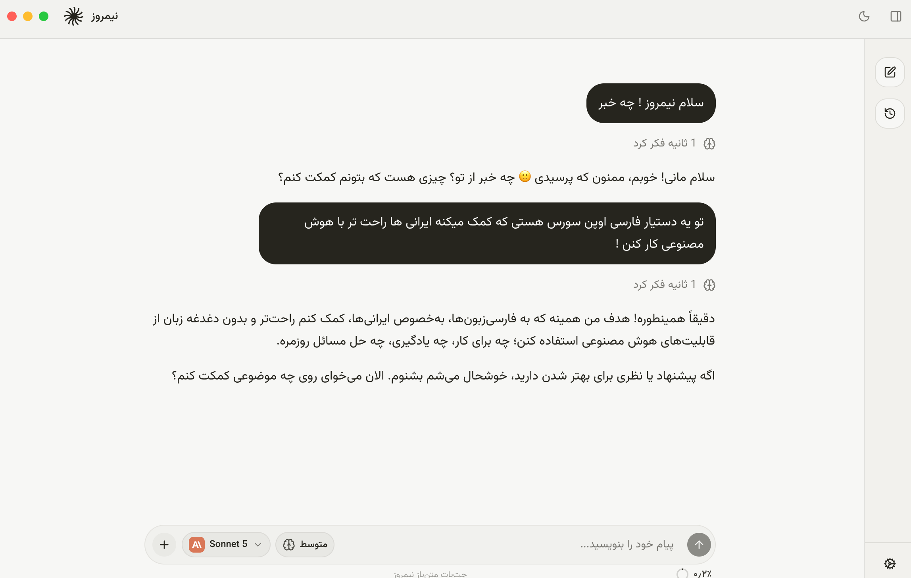
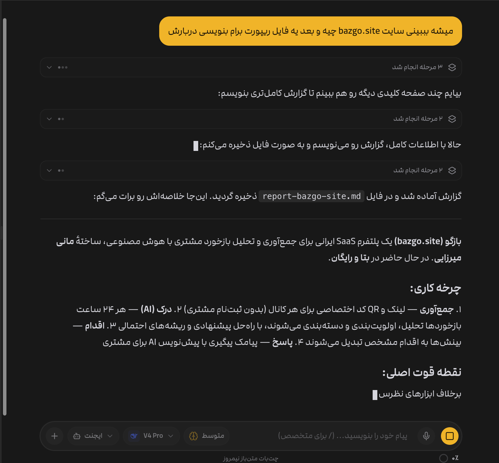
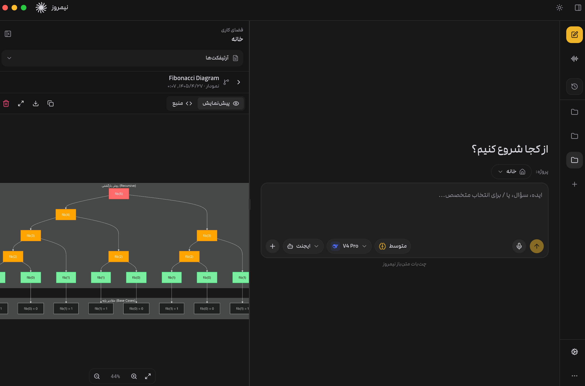
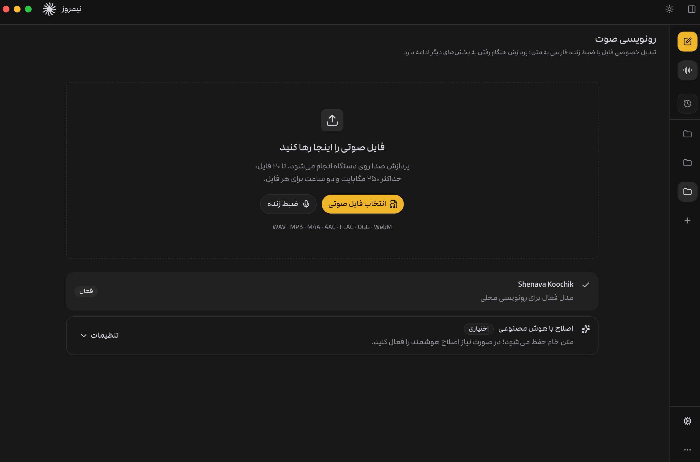
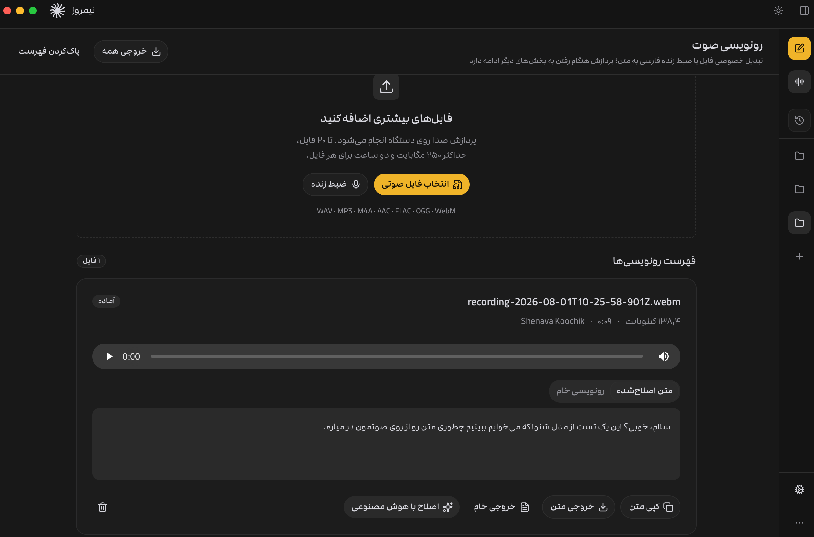
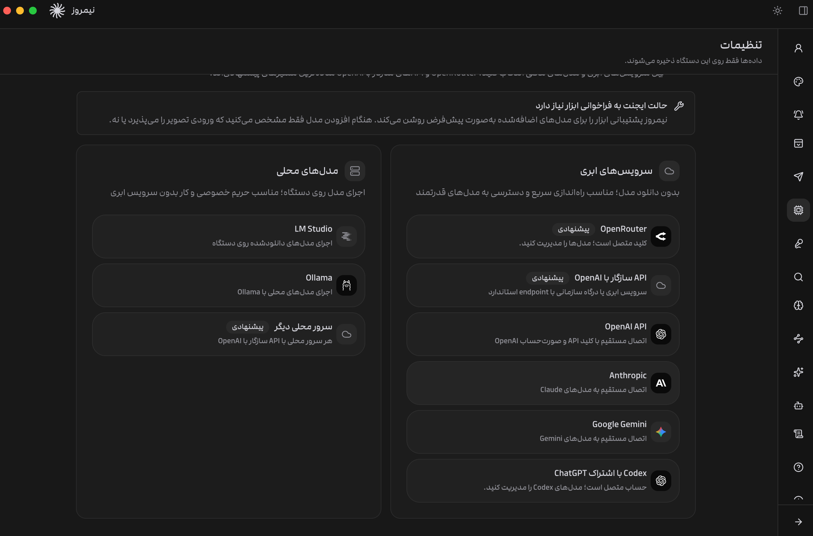
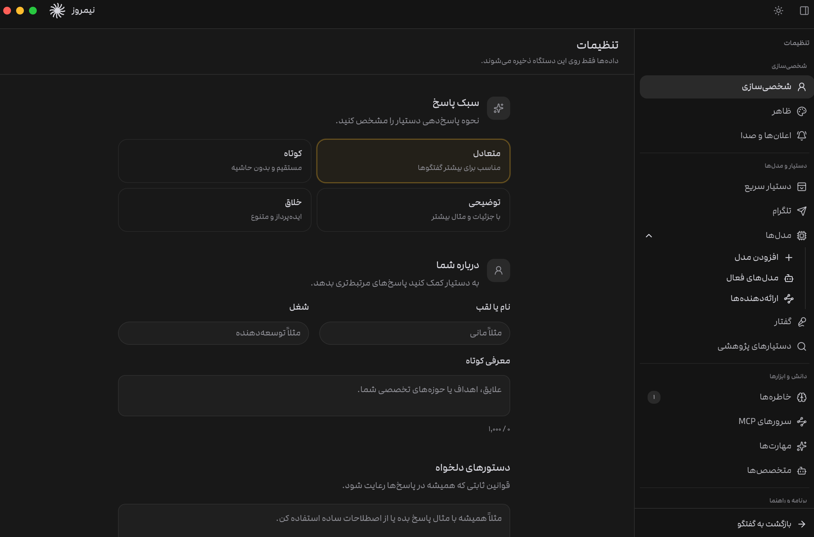
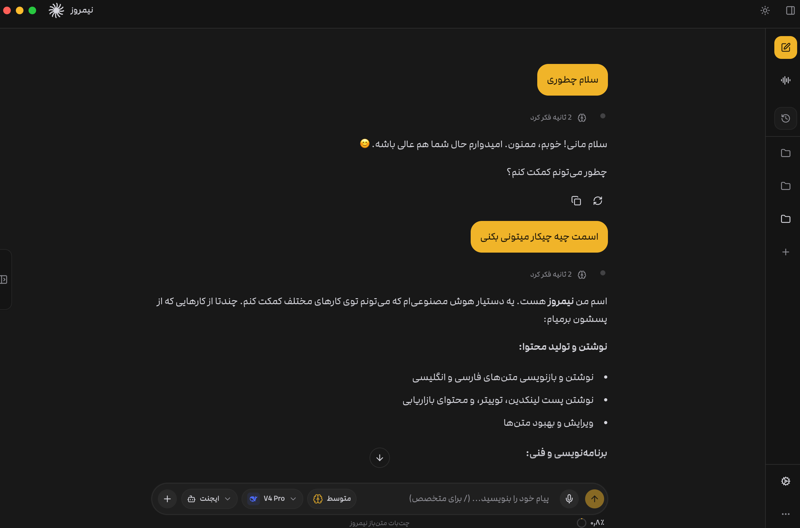

# نیمروز دسکتاپ

> یک ایجنت متن‌باز و فارسی‌محور برای دسکتاپ؛ داخل فایل‌هایتان کار می‌کند، صدایتان را می‌فهمد و از تلگرام همراهتان می‌ماند.

[دانلود آخرین نسخه](https://github.com/xmannii/nimruz-desktop/releases/latest) · [گزارش مشکل](https://github.com/xmannii/nimruz-desktop/issues) · [English](README.md)

نیمروز یک فضای کاری local-first برای کارهایی است که بیشتر از یک کادر چت می‌خواهند. یک پوشهٔ پروژه به آن بدهید، نتیجهٔ مشخص بخواهید و ببینید که فایل‌ها را بررسی می‌کند، ابزارها را به کار می‌گیرد، آرتیفکت می‌سازد و پیش از کارهای حساس از شما تأیید می‌گیرد. می‌توانید فارسی صحبت کنید تا مدل محلی شنوا آن را به متن تبدیل کند، یا از تلگرام به همین ایجنت دسکتاپ پیام بدهید.

> **نرم‌افزار آزمایشی.** نیمروز هنوز در حال توسعه است. دستیار تلگرام فعلاً در بیلدهای `dev` در حال تست است؛ برای استفادهٔ اصلی دسکتاپ از آخرین GitHub Release پایدار استفاده کنید.

## محصول در سه حرکت

| با فضای کاری شروع کنید | طبیعی صحبت کنید | از تلگرام ادامه دهید |
| --- | --- | --- |
| یک پوشهٔ پروژه وصل کنید تا ایجنت زمینهٔ واقعی داشته باشد. | به‌جای تایپ‌کردن همه‌چیز، با فارسی صحبت کنید. | یک ربات BotFather را جفت کنید و از تلفن به ایجنت پیام بدهید. |
| فایل می‌خواند، جست‌وجو می‌کند، ویرایش می‌کند، دستورهای تأییدشده را اجرا می‌کند و خروجی می‌سازد. | شنوا صدا را روی خود دستگاه به متن تبدیل می‌کند. | متن، ویس، عکس، سند، وضعیت پیشرفت و آرتیفکت از طریق ربات ردوبدل می‌شود. |

## فضای کاری ایجنت‌محور

نیمروز گفتگو را به محیطی تبدیل می‌کند که کار واقعاً در آن انجام می‌شود.

- یک یا چند پوشهٔ پروژه را به فضای کاری وصل کنید.
- اجازه دهید ایجنت فایل‌ها را بخواند، فهرست کند، جست‌وجو کند، بنویسد و patch کند.
- دستورهای shell، جست‌وجوی وب و ابزارهای MCP فضای کاری را اجرا کنید.
- کارهای چندمرحله‌ای را با plan، task و subagentهای مستقل پیش ببرید.
- هر اجرا را در timeline ابزار ببینید و فایل‌ها، آرتیفکت‌ها، taskها و فعالیت را در پنل کناری دنبال کنید.
- فایل و آرتیفکت را به پیام اضافه کنید یا با `@` به آن اشاره کنید.

مرز مهم اینجاست: ابزارها به فضای کاری انتخاب‌شده محدود می‌مانند و کارهای پرریسک پیش از اجرا به‌صورت شفاف نمایش داده می‌شوند.

## تبدیل گفتار فارسی به متن

یک‌بار صحبت کنید و ادامه دهید. مدل گفتار شنوا را دانلود و از **تنظیمات ← گفتار** فعال کنید، سپس از میکروفن داخل چت یا صفحهٔ اختصاصی رونویسی استفاده کنید.

- تشخیص گفتار فارسی روی خود دستگاه انجام می‌شود.
- از میکروفن ضبط کنید یا یک فایل صوتی را رونویسی کنید.
- متن خام و متن اصلاح‌شده را کنار هم نگه دارید و خروجی بگیرید.
- ویس‌های تلگرام هم از همین مسیر محلی رونویسی می‌شوند.
- اصلاح اختیاری با مدل انتخابی، نشانه‌گذاری، فاصله‌گذاری و خوانایی متن را بهتر می‌کند.

## دستیار تلگرام

ایجنت دسکتاپ مجبور نیست داخل پنجرهٔ دسکتاپ بماند. یک ربات BotFather وصل کنید، حساب تلگرام را جفت کنید، فضای کاری را انتخاب کنید و از تلفن به نیمروز پیام بدهید.

دستیار تلگرام از این موارد پشتیبانی می‌کند:

- پیام متنی و ویس.
- عکس با مدل vision و فایل‌های PDF و متن/کد پشتیبانی‌شده.
- نمایش پیشرفت هم‌زمان با کار ایجنت.
- گفت‌وگوی تازه، گفتگوهای اخیر، تعویض مدل، توقف اجرا و راهنمای داخل کیبورد ربات.
- ارسال آرتیفکت ساخته‌شده به همان چت تلگرام.

خود برنامه runtime کار است: برای پاسخ‌دادن ربات، نیمروز باید روشن باشد و فضای کاری انتخاب‌شده روی کامپیوتر شما می‌ماند. فقط همان حساب تلگرامی که فرایند جفت‌سازی یک‌بارمصرف را شروع می‌کند پذیرفته می‌شود. نوشتن روی فایل‌ها، دستورهای ترمینال و عملیات حساس همچنان به تأیید نیاز دارند.

## امکانات دیگر

- **انتخاب مدل** — Codex با ورود به ChatGPT، مدل‌های OpenAI، Anthropic، Google Gemini، OpenRouter و سرورهای local یا سازگار با OpenAI.
- **مهارت و متخصص** — بسته‌های `SKILL.md` را در صورت نیاز بارگذاری کنید و متخصص‌های قابل‌استفادهٔ مجدد را با `/` صدا بزنید.
- **حافظه و شخصی‌سازی** — زمینهٔ ماندگار ذخیره کنید و سبک پاسخ‌گویی دستیار را کنترل کنید.
- **پژوهش وب** — وب را جست‌وجو کنید و صفحات عمومی را با ابزارهای امن بخوانید.
- **پنجرهٔ Companion** — با میانبر سراسری، چت کوچکی همیشه در دسترس داشته باشید.
- **رابط فارسی‌محور** — چت راست‌به‌چپ، فونت فارسی، تم روشن/تیره/سیستم و تم رنگی نیمروز.

## تصاویر

این‌ها تصاویر واقعی از رابط فارسی‌محور نیمروز هستند.

### فراخوانی ابزارهای ایجنت

یک هدف به نیمروز بدهید و روند جست‌وجو، فکرکردن و استفاده از ابزارها را داخل فضای کاری دنبال کنید.



### از گفتگو تا خروجی قابل‌استفاده

ایجنت می‌تواند گفتگو را به یک آرتیفکت واقعی تبدیل کند تا آن را پیش‌نمایش و خروجی بگیرید.



### تبدیل گفتار فارسی به متن

شنوا روی خود دستگاه اجرا می‌شود: فایل صوتی انتخاب یا با میکروفن ضبط کنید، سپس متن خام و اصلاح‌شده را بررسی کنید.





<details>
<summary>بخش‌های دیگر برنامه</summary>

### ارائه‌دهنده‌های مدل

ارائه‌دهنده‌های ابری، سازگار و local را از یک صفحه وصل و مدیریت کنید.



### شخصی‌سازی

سبک پاسخ، زمینهٔ پروفایل و دستورالعمل‌های دلخواه دستیار را تنظیم کنید.



### چت ساده

برای پرسش‌های سریع، از گفتگویی سبک و بدون ابزارهای فضای کاری استفاده کنید.



</details>

تصویر بعدی که بیشترین ارزش را دارد یک اجرای تلگرام است: ویس یا پیام متنی ← وضعیت پیشرفت ← پاسخ نهایی ← آرتیفکت ارسال‌شده. برای حالت دقیق تصویر و نکات حذف اطلاعات خصوصی به [راهنمای اسکرین‌شات README](docs/README-SCREENSHOTS.md) مراجعه کنید.

## دانلود

نصب‌کننده‌های آماده در هر [GitHub Release](https://github.com/xmannii/nimruz-desktop/releases) منتشر می‌شوند.

| پلتفرم | نصب‌کننده | دریافت |
| --- | --- | --- |
| **macOS** (Apple Silicon) | `.dmg` | [آخرین نسخه](https://github.com/xmannii/nimruz-desktop/releases/latest) |
| **Windows** | `.exe` (NSIS) | [آخرین نسخه](https://github.com/xmannii/nimruz-desktop/releases/latest) |
| **Linux** | AppImage | ساخت محلی با `pnpm dist` |

نسخهٔ در حال توسعهٔ [`dev-latest`](https://github.com/xmannii/nimruz-desktop/releases/tag/dev-latest) ممکن است تغییرات دستیار تلگرام را پیش از انتشار پایدار داشته باشد.

### نصب در macOS

1. آخرین `.dmg` را از [Releases](https://github.com/xmannii/nimruz-desktop/releases/latest) دانلود کنید.
2. DMG را باز کنید و **Nimruz** را به **Applications** بکشید.
3. روی **Nimruz** در Applications راست‌کلیک کنید، **Open** و سپس دوباره **Open** را بزنید.

بیلدهای مک هنوز code-sign و notarize نشده‌اند. اگر Gatekeeper برنامه را مسدود کرد، از **System Settings → Privacy & Security** گزینهٔ **Open Anyway** کنار Nimruz را بزنید. راه جایگزین در ترمینال:

```bash
xattr -dr com.apple.quarantine /Applications/Nimruz.app
```

### نصب در ویندوز

1. آخرین `.exe` را از [Releases](https://github.com/xmannii/nimruz-desktop/releases/latest) دانلود کنید.
2. نصب‌کننده را اجرا کنید و مراحل را دنبال کنید.

## شروع سریع

1. نیمروز را باز کنید و تور شروع را کامل یا رد کنید.
2. به **تنظیمات ← مدل‌ها ← ارائه‌دهنده‌ها** بروید و یک مدل وصل کنید: Codex با حساب واجد شرایط ChatGPT، OpenRouter یا یک ارائه‌دهندهٔ سازگار با OpenAI/local.
3. یک **فضای کاری** بسازید یا باز کنید و در صورت نیاز پوشهٔ پروژه را وصل کنید.
4. در چت ایجنت یک نتیجهٔ مشخص بخواهید، مثلاً:

   > ساختار این پروژه را بررسی کن، خلاصه‌اش را بگو و یک `TODO.md` کوتاه بساز. قبل از تغییر فایل‌ها از من تأیید بگیر.

5. فقط عملیات‌هایی را تأیید کنید که می‌خواهید اجرا شوند.

### فعال‌کردن ورودی صوتی

به **تنظیمات ← گفتار** بروید، یک مدل شنوا دانلود و فعال کنید و بعد از دکمهٔ میکروفن در کامپوزر چت استفاده کنید. برای فایل‌ها یا ضبط‌های طولانی‌تر، صفحهٔ **رونویسی** را باز کنید.

### اتصال تلگرام

1. در تلگرام به [@BotFather](https://t.me/BotFather) پیام دهید، `/newbot` را اجرا کنید و توکن را کپی کنید.
2. در نیمروز به **تنظیمات ← تلگرام** بروید، توکن را وارد کنید و فضای کاری مجاز ربات را انتخاب کنید.
3. جفت‌سازی یک‌بارمصرف را شروع کنید و لینک آن را با همان حساب تلگرامی که می‌خواهید مجاز شود باز کنید.
4. نیمروز را روشن نگه دارید و بعد به ربات پیام متنی یا ویس بفرستید.

توکن ربات از طریق فضای امن سیستم‌عامل نگه‌داری می‌شود. برای استفادهٔ معمول به `.env` نیاز نیست.

## محلی‌محور به‌صورت پیش‌فرض

نیمروز گفتگوها، فضاهای کاری، حافظه، متخصص‌ها، مهارت‌ها، تنظیمات، اجراها، taskها و آرتیفکت‌ها را در دادهٔ محلی برنامه ذخیره می‌کند. کلیدهای API و نشست Codex در فضای امن سیستم‌عامل نگه‌داری می‌شوند. اگر مدل ابری انتخاب کنید، prompt و فایل‌های لازم برای تولید پاسخ به همان ارائه‌دهنده فرستاده می‌شوند؛ نیمروز ادعا نمی‌کند inference ابری محلی است.

ابزارهای فضای کاری به مسیرهای مجاز محدودند. نوشتن، shell، فراخوانی MCP و عملیات حساس می‌تواند به تأیید نیاز داشته باشد. تلگرام فقط کانال ورودی/خروجی از راه دور برای runtime محلی دسکتاپ است، نه یک کپی میزبانی‌شده از فضای کاری.

### نکته دربارهٔ Codex

نیمروز می‌تواند از مسیر رسمی ورود با ChatGPT به Codex وصل شود و آن را به‌عنوان مدل کدنویسی در محیطی ایزوله اجرا کند. Codex به workspaceهای متصل نیمروز، shell، ابزارهای وب، MCP یا تلگرام دسترسی ندارد. این اتصال از دسترسی Codex حساب ChatGPT استفاده می‌کند و **اشتراک ChatGPT را به اعتبار عمومی API اوپن‌ای‌آی تبدیل نمی‌کند**.

## ساخت از کد منبع

### پیش‌نیازها

- [Node.js](https://nodejs.org/) نسخهٔ ۲۲٫۱۳٫۰ یا جدیدتر
- [pnpm](https://pnpm.io/) نسخهٔ ۹ یا جدیدتر

```bash
git clone https://github.com/xmannii/nimruz-desktop.git
cd nimruz-desktop
pnpm install
pnpm dev
```

### اسکریپت‌های کاربردی

| دستور | توضیح |
| --- | --- |
| `pnpm dev` | اجرای Vite و Electron در حالت توسعه |
| `pnpm build` | ساخت renderer و پردازش اصلی Electron |
| `pnpm start` | ساخت و اجرای برنامه |
| `pnpm dist` | ساخت نصب‌کنندهٔ پلتفرم |
| `pnpm typecheck` | اجرای بررسی TypeScript |
| `pnpm test` | اجرای تست‌های واحد |

سرورهای MCP مخصوص هر فضای کاری از **تنظیمات ← سرورهای MCP** قابل تنظیم‌اند. برای transportها، چرخهٔ عمر و مرز احراز هویت به [راهنمای MCP](docs/MCP.md) و برای تنظیم ارائه‌دهنده‌ها به [راهنمای مدل‌ها](docs/PROVIDERS.md) مراجعه کنید.

## مشارکت

از مشارکت استقبال می‌کنیم. جزئیات راه‌اندازی، بررسی‌ها و pull request در [CONTRIBUTING.md](CONTRIBUTING.md) آمده است. تغییرات محصول و release noteها در [CHANGELOG.md](CHANGELOG.md) ثبت می‌شوند.

## مجوز

این پروژه تحت [مجوز MIT](LICENSE) منتشر شده است.
