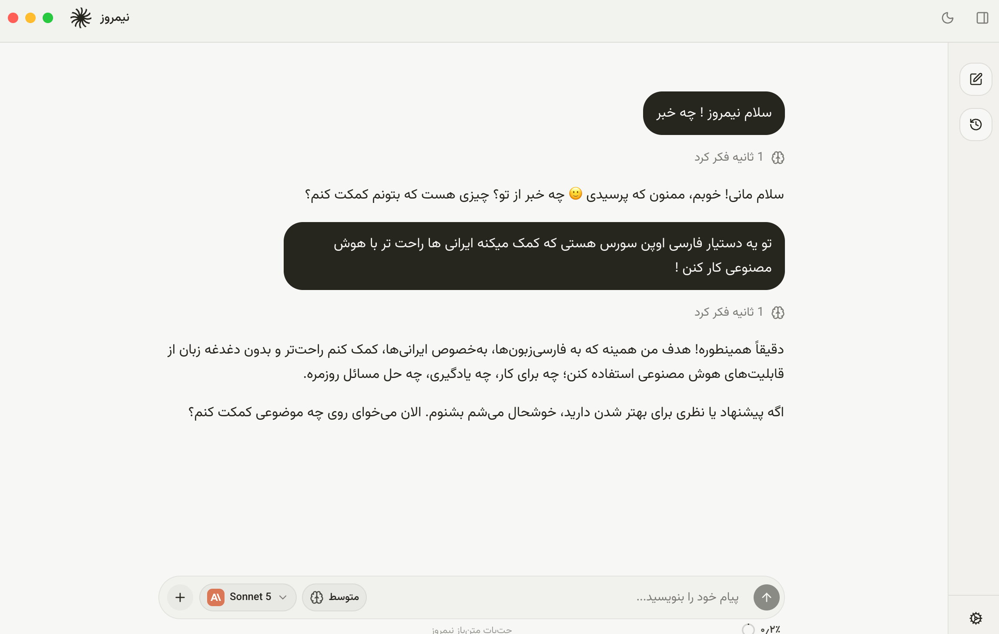

# Nimruz Desktop

**نیمروز** — an open-source Persian AI chat desktop app built with Electron, React, and the [Vercel AI SDK](https://github.com/vercel/ai).

> **Experimental software** — Nimruz is early-stage and may contain bugs or rough edges. Please test it, expect occasional issues, and [report problems on GitHub](https://github.com/xmannii/nimruz-desktop/issues) so we can fix them.

Nimruz connects to [OpenRouter](https://openrouter.ai/) (and custom OpenAI-compatible providers) so you can chat with many models from one native app. Chats, projects, memories, and personalization settings are stored locally on your machine.

## Download

Pre-built installers are on the [Releases](https://github.com/xmannii/nimruz-desktop/releases) page.

- [Nimruz 0.1.0 for macOS (Apple Silicon)](https://github.com/xmannii/nimruz-desktop/releases/download/v0.1.0/Nimruz-0.1.0-arm64.dmg)

**Windows** — a pre-built installer is coming soon.

**Other platforms** — you can build Windows (NSIS), Linux (AppImage), and macOS installers yourself on the target OS with `pnpm dist` (see [Build a distributable](#build-a-distributable) below).

### macOS install

1. Open the DMG and drag **Nimruz** to **Applications**.
2. Open Nimruz using one of the methods below.

macOS builds are not code-signed or notarized yet, so Gatekeeper may block the app. The **“Nimruz is damaged and can’t be opened”** message is misleading — the app is fine; macOS is rejecting an unsigned download.

**Recommended:** Right-click **Nimruz** in Applications → **Open** → **Open** again. You only need to do this once.

**Alternative:** Remove the download quarantine flag, then open normally:

```bash
xattr -dr com.apple.quarantine /Applications/Nimruz.app
```

**If macOS already blocked the app:** Open **System Settings → Privacy & Security** and click **Open Anyway** next to the Nimruz entry.

## Features

- **Streaming chat** with markdown, code blocks, math, Mermaid diagrams, and CJK support
- **OpenRouter integration** — browse, favorite, and switch models; optional reasoning effort controls
- **Custom providers** — add OpenAI-compatible endpoints with your own API keys
- **Projects** — organize conversations by topic or workflow
- **Memories** — the assistant can save and forget durable facts about you over time
- **Personalization** — response style, custom instructions, and profile context
- **Local-first storage** — SQLite database in Electron `userData`; API keys encrypted with the OS keychain
- **Cross-platform builds** — macOS (DMG), Windows (NSIS), and Linux (AppImage)

## Screenshots

_Add screenshots here after publishing the repository._

## Getting started

### Prerequisites

- [Node.js](https://nodejs.org/) 20 or newer
- [pnpm](https://pnpm.io/) 9 or newer

### Install and run

```bash
git clone https://github.com/xmannii/nimruz-desktop.git
cd nimruz-desktop
pnpm install
pnpm dev
```

On first launch, open **Settings → Models** to add your OpenRouter API key. The key is encrypted through macOS Keychain, Windows DPAPI, or a Linux libsecret/KWallet keyring. On Linux, storage is refused when only Electron's insecure `basic_text` backend is available.

No `.env` file is required for normal use — credentials are managed inside the app.

### Build a distributable

```bash
pnpm dist
```

Installers are written to `release/` (DMG / NSIS / AppImage depending on your platform).

### Release (GitHub Actions)

Bump the version in `package.json`, commit, and push to `main`. GitHub Actions builds Windows + macOS installers and publishes them to [Releases](https://github.com/xmannii/nimruz-desktop/releases).

```bash
# 1. Change "version" in package.json (e.g. 0.1.2 → 0.1.3)
# 2. Commit and push:
git add package.json
git commit -m "Bump version to 0.1.3"
git push origin main
```

You can also run the **Release** workflow manually from the Actions tab.

## Architecture

```
Electron main (Node)
├─ authenticated local HTTP server
│  ├─ POST /api/chat  → streamText + OpenRouter
│  └─ GET  /*         → static renderer (production only)
├─ SQLite database    → chats, projects, memories, personalization
├─ safeStorage        → encrypted API keys
└─ BrowserWindow → sandboxed Vite renderer
```

- **Dev:** Vite serves the renderer on `:5173` and proxies `/api` to the main-process server on `:43117`.
- **Prod:** the main-process server serves both the static renderer and the chat API on one random localhost port.

## Tech stack

| Layer | Tools |
| --- | --- |
| Desktop shell | Electron |
| UI | React 19, TanStack Router, Tailwind CSS 4, shadcn/ui |
| AI | Vercel AI SDK, OpenRouter provider |
| Storage | better-sqlite3 (via Electron main), OS keychain |
| Build | Vite, esbuild, electron-builder |

## Scripts

| Command | Description |
| --- | --- |
| `pnpm dev` | Start Vite + Electron in development |
| `pnpm build` | Build renderer and main process |
| `pnpm start` | Build and launch Electron |
| `pnpm dist` | Build platform installer |
| `pnpm typecheck` | Run TypeScript checks |
| `pnpm test` | Run unit tests |

## Local data

Application data lives in Electron's platform-specific `userData` directory (folder name **Nimruz**) as `nimruz.sqlite3`. Legacy IndexedDB/localStorage data is imported once and kept as a rollback copy. Saved API keys are not portable between machines or OS users.

## Relationship to the web app

This repository is an independent desktop app. UI code under `src/components`, `src/lib`, and `src/hooks` was originally copied from a Next.js web client. The two apps can diverge; port UI changes manually when you want them in both places.

## Contributing

Contributions are welcome. See [CONTRIBUTING.md](CONTRIBUTING.md) for setup, checks, and PR guidelines.

## License

This project is licensed under the [MIT License](LICENSE).
